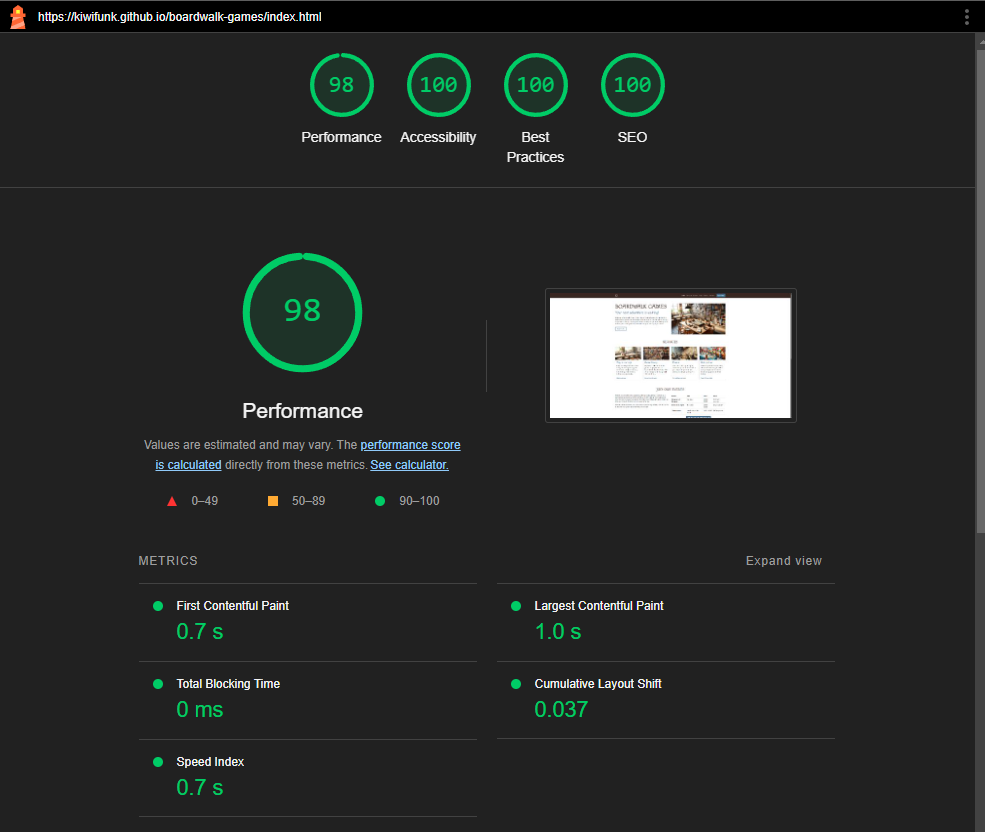

# boardwalk-games
Boardwalk Games is your local destination for board games and refreshments. Our shop and café combination offers a unique experience where you can browse our extensive game library, enjoy café refreshments, and participate in various gaming events. We host regular tournaments and kids' parties while maintaining a welcoming atmosphere for both casual and serious gamers.

A website for a fictitious game shop and cafe. The aim of this site is to provide users an overview of services offered, and a look at the current library of games offered, and current menu of the cafe. Forms are in place to allow users to reserve games, book events such as tournaments and kids parties, and subscribe to a newsletter to keep in touch with any new games or service changes. Each of these feature a success page to make sure the user can have peace of mind their submission was a success.

# Page Features

Images are only loaded as they become visible using the lazy class, saving resources and making the page load faster on devices with slower connections such as mobile. Having this functionality built in will be useful if the store ever wants to expand and add more products, as this will prevent loading dozens of unnecessary product images all at once.

Page performance looks good on the lighthouse test, and steps have been made to optimize where feasible. Aria and alt tags ensure that the page is accessible for people who need screen readers, and a simple contrasting color scheme is used to make it easier for visually impaired users.